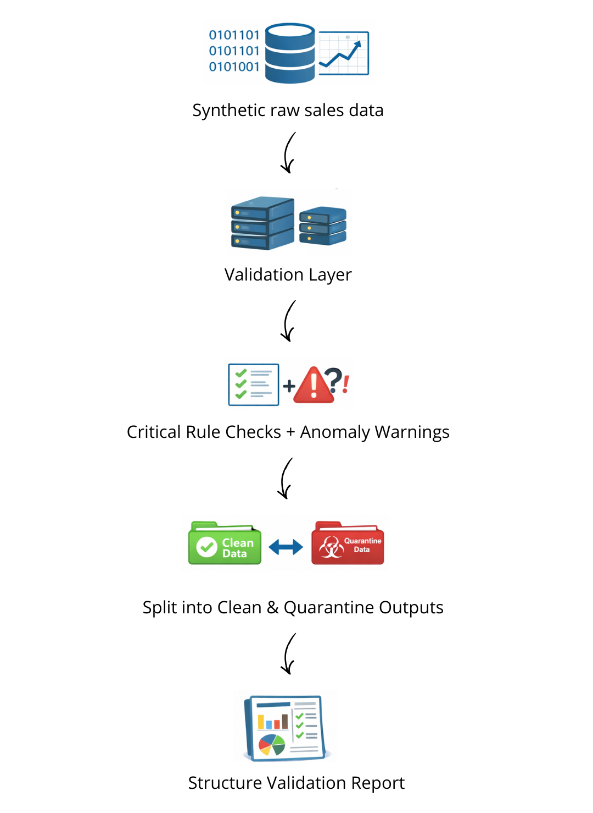

# Data Quality Framework

A small Data Engineering portfolio project that demonstrates how to implement an automated data validation layer before loading daily sales data into a warehouse.

## Overview

Companies often receive raw operational data with quality issues such as missing values, duplicates, invalid formats, and inconsistent business logic.  
This project simulates a real-world validation layer that checks incoming sales data before it is accepted into downstream analytical systems.

The pipeline validates raw data, separates valid and invalid records, and generates a structured quality report for auditing and monitoring purposes.

## Business Scenario

A company receives daily sales data from operational systems and third-party sources.  
Before loading that data into a warehouse, the engineering team must validate the dataset to prevent unreliable records from reaching analytics and reporting layers.

Common data quality problems include:

- missing critical fields
- duplicate transactions
- schema inconsistencies
- invalid numeric ranges
- malformed dates
- suspicious outliers
- business rule mismatches

## Project Goal

Build a lightweight data quality framework that demonstrates core reliability practices in a data pipeline:

- validate incoming sales data automatically
- detect critical and non-critical quality issues
- quarantine invalid records
- preserve clean records for downstream loading
- generate a structured validation report

## Tech Stack

- Python
- Pandas
- Great Expectations
- JSON / CSV outputs

## Repository Structure

```text
data-quality-framework/
│
├── data/
│   ├── raw/
│   │   └── sales_daily.csv
│   ├── clean/
│   │   └── sales_daily_clean.csv
│   └── quarantine/
│       └── sales_daily_invalid.csv
│
├── docs/
│
├── reports/
│   └── validation_report.json
│
├── scripts/
│   └── generate_sales_data.py
│
├── validation/
│   ├── expectations/
│   │   └── sales_expectations.py
│   ├── config.py
│   ├── run_validation.py
│   └── utils.py
│
├── requirements.txt
├── .gitignore
└── README.md
```

## Pipeline Flow



## Validation Rules

The framework applies both framework-based and custom validation rules.

### Critical validations

Records are rejected and moved to quarantine if they fail one or more of these checks:

- required columns must exist in the expected schema
- critical fields must not be null
- `order_id` must be unique
- `quantity` must be greater than 0
- `unit_price` must be greater than 0
- `discount_pct` must be between 0 and 0.50
- `order_date` must be parseable as a valid date
- `sales_amount` must match the expected business calculation:
  - `quantity * unit_price * (1 - discount_pct)`

### Warning-level validations

These checks do not automatically quarantine the record, but they are reported for monitoring:

- `unit_price` outliers
- `sales_amount` outliers

## Data Generation

The raw input dataset is synthetically generated to simulate a realistic daily sales feed.

The generator intentionally injects controlled data quality issues, including:

- missing values
- duplicate rows / duplicate order IDs
- invalid numeric ranges
- malformed dates
- amount inconsistencies
- anomalies

This makes the project suitable for demonstrating practical validation behavior in a realistic portfolio setting.

## Outputs

After each run, the pipeline generates three main outputs:

### 1. Clean dataset

```text
data/clean/sales_daily_clean.csv
```

Contains records that passed all critical validation rules.

### 2. Quarantine dataset

```text
data/quarantine/sales_daily_invalid.csv
```

Contains records that failed one or more critical validation rules.

This file also includes a `failed_rules` column to make debugging and remediation easier.

### 3. Validation report

```text
reports/validation_report.json
```

Contains:

- run timestamp
- input and output file paths
- total processed rows
- valid vs invalid row counts
- pass/fail percentages
- dataset-level failures
- critical rule counts
- warning counts

## How to Run

### 1. Create and activate a virtual environment

On Windows PowerShell:

```bash
py -3.12 -m venv .venv
.venv\Scripts\Activate.ps1
```

### 2. Install dependencies

```bash
pip install -r requirements.txt
```

### 3. Generate the raw dataset

```bash
python scripts/generate_sales_data.py
```

### 4. Run the validation pipeline

```bash
python -m validation.run_validation
```

## Example Execution Result

A typical pipeline run produces:

- a clean dataset for downstream loading
- a quarantine dataset for rejected records
- a JSON report summarizing data quality metrics

Example terminal summary:

```text
=== DATA QUALITY VALIDATION SUMMARY ===

Dataset-level failures:
  - order_id_unique
  - quantity_min_value
  - unit_price_positive
  - discount_pct_range

Row-level critical failures:
  - schema_mismatch: 0 rows
  - missing_critical_values: 75 rows
  - duplicate_order_ids: 100 rows
  - invalid_order_date: 25 rows
  - sales_amount_inconsistency: 50 rows
  - quantity_range_invalid: 30 rows
  - unit_price_range_invalid: 20 rows
  - discount_pct_range_invalid: 25 rows

Row-level warnings:
  - unit_price_outliers: 40 rows
  - sales_amount_outliers: 45 rows
```

## Why This Project Matters

This project demonstrates practical Data Engineering capabilities beyond simple file processing.

It shows how to:

- build a validation gate before warehouse ingestion
- separate clean and invalid data paths
- combine Great Expectations with custom business logic
- produce auditable outputs for quality monitoring
- structure a small but realistic reliability-focused pipeline

## Future Improvements

Possible next iterations:

- support multiple raw files per day
- add Parquet outputs
- store validation history across runs
- expose metrics in a dashboard
- orchestrate the pipeline with Airflow or Prefect
- add CI checks for validation scripts
- containerize the project with Docker

## Portfolio Positioning

This project is designed to showcase data reliability practices in a compact and realistic format.  
It is intentionally small enough to build quickly, while still demonstrating concepts that are highly relevant in production data platforms.
